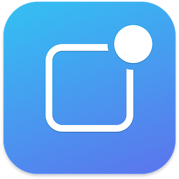

# DarknessPush
Crossplatform APNS utility on your iOS/iPadOS/Android/macOS!

## Requirements:
- iOS 9.0+
- iPadOS 9.0+
- Android 4.1+
- macOS 10.11+

## Features:
- Free
- Open source
- Rich set of APNS fields
- Autosave all input data for next sessions

## APNS testing fields:
- Team ID
- P8 Auth Key
- Key ID (fills automatically from P8 filename)
- Bundle ID
- Body
- Collapse ID (optional)
- APNS type (alert by default)
- Environment (production by default)
- Priority (10 by default)

